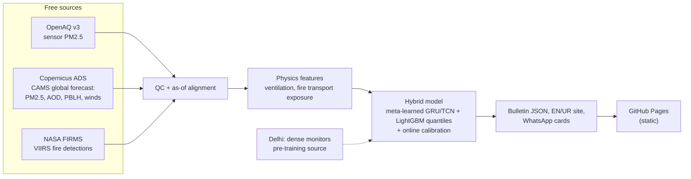

# SmogSense

**Probabilistic, bilingual PM2.5 forecasts for Lahore: built from free satellite and model data, few-shot transfer learning from Delhi, and a pipeline that costs exactly $0.**

SmogSense is a research-engineering project (a final-year capstone) that every morning publishes a **72-hour forecast of Lahore's PM2.5 as a range, not a single guess**, in English and Urdu, as a lightweight website, an open JSON file and a WhatsApp-ready image card.
It is designed for *sensor-sparse regions*: instead of leaning on a dense sensor network, it leans on globally available data (CAMS forecasts, NASA fire detections) and on what a model learned in a data-rich neighbour (Delhi) about the Indo-Gangetic airshed.

> ⚠️ **Research project, not an official forecast.** Do not rely on it alone for medical or emergency decisions. Follow guidance from the official health and environmental authorities.

## Why this exists

Every winter, Lahore and the Indo-Gangetic Plain sit under a layer of fine particulate matter driven by local emissions, crop-residue burning and shallow, stagnant winter air. Regulatory monitoring is sparse relative to the population and to how much pollution varies from street to street, so the usual recipe (dense sensors → machine learning)
fails exactly where it is needed. Reliable 24–72-hour warnings support **SDG 3** (health and well-being), **SDG 11** (sustainable cities and communities) and **SDG 13** (climate action).

## What it produces

* **Forecast page** (English and Urdu Nastaliq): category + one protective action first, then the number, then the uncertainty ("real levels fall inside this range on 8 days out of 10; 1 day in 10 is worse").
* **`forecast/latest.json`**: an open, schema-validated bulletin (quantiles from the 5th to the 95th percentile, per horizon and station) for journalists, planners and apps.
* **WhatsApp cards**: 1080×1350 share images and Open Graph previews with correctly shaped Urdu.
* **Public accuracy page**: rolling prospective scores against a fair baseline, with sample sizes.

## How it works



Five ideas carry the project:

1. **Physics in the features.** Concentration ∝ emissions ÷ *ventilation* (boundary-layer height × wind), so ventilation, its inverse (dilution index) and stagnation run-lengths are first-class inputs; so is **wind-aligned fire transport exposure** defined *relative to each target*, which transfers between cities.
2. **Point-in-time honesty.** Every feature obeys an *as-of* rule (e.g. a 00:00 UTC forecast can only see the *previous day's 12 UTC* CAMS run). Training and serving use the **same** CAMS product, so there is no reanalysis-to-forecast skew.
3. **Sparse-network meta-learning.** Training tasks simulate networks with 0, 1, 2, 3, 5, 8 available stations; a first-order MAML encoder learns to adapt fast, while LightGBM quantile boosters are adapted by warm-start residual boosting (trees cannot be meta-differentiated).
4. **Quantiles, scored properly.** 19 quantile levels, non-crossing by construction or by rearrangement, scored with CRPS against a **bias-corrected CAMS** baseline (the fair one) and verified **prospectively** during the 2026–27 smog season.
5. **Degrade, don't fail.** A four-level ladder (full → stale CAMS → baseline → observations-only) publishes a *labelled* simpler forecast rather than nothing; a watchdog catches the day nothing runs at all.

> **Different from the original research plan.** The plan was a starting point; claims were verified against provider documentation and by experiment. The ten most consequential corrections (CAMS timing, fire-box geometry, LightGBM multi-quantile, MAML scope, satellite retirements, spline gap-filling, and more)
> are in the [**verification log**](docs/verification-log.md).

## Data sources and attribution

| Source | Used for | Free-tier facts (verified Oct 2026) | Attribution |
|---|---|---|---|
| [OpenAQ](https://openaq.org) API v3 + AWS archive | Ground-truth PM2.5, backfill, scoring | 60 req/min **and** 2,000 req/h; archive lags 72 h | Observations from OpenAQ and its data providers (CC BY 4.0) |
| Copernicus ADS — CAMS global forecasts | PM2.5 baseline, meteorology, AOD | 0.4°, 00/12 UTC, 5 days; 00Z available by 10:00 UTC | *Generated using Copernicus Atmosphere Monitoring Service information 2026.* Neither the European Commission nor ECMWF is responsible for any use that may be made of the Copernicus information or data it contains. |
| Copernicus CDS — ERA5 | Hindcast diagnostics only | ≈ 5-day latency | *Generated using Copernicus Climate Change Service information 2026.* |
| NASA FIRMS (VIIRS NOAA-21/NOAA-20) | Fire detections | MAP_KEY; 5,000 transactions/10 min; Suomi-NPP ends 2026-11-01 | We acknowledge the use of data and/or imagery from NASA's Fire Information for Resource Management System (FIRMS), part of NASA's Earth Science Data and Information System (ESDIS). |
| Noto Sans / Noto Nastaliq Urdu | Typography | SIL OFL 1.1 | © The Noto Project Authors |

Code is MIT-licensed ([LICENSE](LICENSE)); data licences are those of the providers above.

## Repository layout

```
.github/workflows/   ci · docker-publish · daily-forecast · shadow-scoring · historical-backfill · model-retrain · repo-keepalive
configs/             domains · sources · preprocessing · features · model · evaluation · bulletin   (all parameters, validated)
data/                raw · interim · processed · external (never committed)   schemas/ (tracked data contracts)
docker/  Dockerfile  docker-compose.yml        one image for laptop, CI and production (CPU only)
docs/                PRD · system-architecture · data-engineering · ml-architecture · evaluation-strategy ·
                     deployment-and-ops · dissemination-and-ui · verification-log · runbooks/
models/              README + model-card template (weights live in GitHub Releases)
scripts/             bootstrap, state-branch and gh-pages publishing, alert helper (shellcheck-clean)
src/smogsense/       data_ingestion · preprocessing · features · models · inference · evaluation · visualization · publishing
tests/               unit · contract · integration · e2e · fixtures
web/                 i18n (en/ur) · Jinja2 templates · design tokens · static assets
```

## Quickstart

Prerequisites: Docker with the Compose plugin, GNU Make, Git. Nothing else is installed on your machine.

```bash
git clone https://github.com/<your-username>/smogsense.git && cd smogsense
./scripts/bootstrap.sh     # checks prerequisites, creates .env, prepares bind-mount directories
$EDITOR .env               # free API keys: docs/deployment-and-ops.md#3-secrets-and-variables
make lock                  # generate uv.lock (needs internet) and commit it
make build                 # build the lean runtime image (CPU-only PyTorch, GDAL, LightGBM)
make check                 # ruff + strict mypy + pytest inside the container, identical to CI
```

| Target | What it does | Available |
|---|---|---|
| `make lock` · `build` · `shell` · `lint` · `test` · `check` · `docs-check` | developer workflow, repo-contract tests (schemas, i18n parity, link integrity, guardrails) | **now (Phase 0)** |
| `make doctor` | validate credentials and config | end of Phase 0 |
| `make daily ISSUANCE=2026-11-05T00:00:00Z` | the full daily cycle for one issuance | Phase 1 (grows through Phase 4) |
| `make demo` | offline end-to-end run on recorded fixtures, served at <http://localhost:8080> | Phase 4 |
| `make serve` | serve `./site` locally | Phase 4 |

The skeleton is deliberately **specification-first**: package modules are contract stubs (each docstring states the module's responsibility, interface and the document section that specifies it); the configuration, schemas, workflows, container and tests are real and already run.

## Zero-cost guarantee

| Need | Free resource | Limit that matters |
|---|---|---|
| Compute | GitHub Actions (public repo: 4 vCPU / 16 GB, unmetered) — designed for the 2 vCPU / 7 GB private runner | ≈ 25 min per daily run |
| Hosting | GitHub Pages (+ optional Cloudflare Pages mirror) | ≤ 1 GB site, ≈ 100 GB/month soft bandwidth |
| Images | GHCR (public) | public packages free |
| Models & datasets | GitHub Releases | 2 GiB per asset |
| State | orphan `state` branch (append-only Parquet, ≈ 150 KB/day) | ≪ 1 GB |
| Alerts | GitHub issues and notifications; optional Telegram | – |

Nothing here needs a credit card, a paid API, a GPU, or an LLM. A test fails the build if a paid-SDK dependency is introduced. Details and the red lines: [deployment & operations](docs/deployment-and-ops.md#1-zero-cost-resource-budget).

## Evaluation at a glance

A ladder of nine methods (persistence → raw CAMS → **bias-corrected CAMS** → climatology → Lahore-only LightGBM → Delhi zero-shot → Delhi fine-tuned → **meta-learned hybrid** → calibrated hybrid) is scored with CRPS on a pre-registered protocol, including the **Sensor-Sparsity Curve** (skill vs number of available stations, $N=0,1,2,3,5,8,\dots$).
Six hypotheses with numeric thresholds are fixed *before* the season ([evaluation strategy](docs/evaluation-strategy.md)); failures are reported with the same prominence as successes.

## Documentation

| Document | Purpose |
|---|---|
| [PRD](docs/PRD.md) | Requirements, accuracy targets, latency budgets, localisation rules |
| [System architecture](docs/system-architecture.md) | Dataflow, the 00:00 UTC cycle, as-of rule, CLI contract, degradation ladder |
| [Data engineering](docs/data-engineering.md) | OpenAQ, CAMS/ERA5, FIRMS, QC, imputation, alignment protocols |
| [ML architecture](docs/ml-architecture.md) | Features, fire exposure, encoder, quantile heads, MAML, calibration, model ladder |
| [Evaluation strategy](docs/evaluation-strategy.md) | CRPS blueprint, sparsity experiment, statistics, shadow run |
| [Deployment & ops](docs/deployment-and-ops.md) | Free-tier budget, secrets, workflows, alerting, disaster recovery |
| [Dissemination & UI](docs/dissemination-and-ui.md) | Risk communication, design system, Urdu rules, cards, review protocol |
| [Verification log](docs/verification-log.md) | What the original plan got right and wrong, with evidence |
| [Runbooks](docs/runbooks/incident-response.md) | Incident response · [season-start checklist](docs/runbooks/season-start-checklist.md) |

## Status and roadmap

Dates assume the capstone started in early October 2026 and are built backwards from the **smog season** (late October–January), not from the defence date.

| Phase | Window (2026–27) | Outcome |
|---|---|---|
| 0 Scaffolding | 5–9 Oct | Repo, container, CI green, credentials, `uv.lock` — **specification and configuration delivered** |
| 1 Zero-cost ETL | 12–30 Oct | Ingestion, QC, baselines and the **shadow ledger running from 19 Oct** (fallback 26 Oct) |
| 2 Features + transfer | 2–27 Nov | Backfill, feature store, Delhi pre-training, meta-learning |
| 3 Probabilistic engine | 23 Nov–18 Dec | LightGBM quantile ensemble, CRPS and sparsity evaluation, challenger in shadow from 7 Dec |
| 4 Delivery | 16 Nov–22 Dec | Bilingual site, cards, Telegram, expert review, public launch 22 Dec |
| 5 Shadow season and defence | 19 Oct–31 Jan live; February onward analysis | Prospective verification, H1–H6 verdicts, thesis |

The plan is deliberately tight (≈ 400 working hours); the roadmap defines the minimum viable capstone and the order in which scope is cut if time runs out.

## Responsible use and limitations

SmogSense forecasts a 24-hour block mean on a ~40 km atmospheric-model grid adjusted to sensor locations; it cannot resolve a single street. Low-cost sensors saturate and drift in extreme smog; upper quantiles there are the least certain part of the product.
One season is one climate realisation, and the model is Lahore-specific. The model card template ([models/](models/README.md)) lists the limitations every released bundle must declare, and the [verification log](docs/verification-log.md) records what was and was not verified.

## Contributing, security, citation

[CONTRIBUTING](CONTRIBUTING.md) (ground rules: $0 budget, container parity, scientific honesty, point-in-time correctness, bilingual by default) · [SECURITY](SECURITY.md) · cite via [CITATION.cff](CITATION.cff) · licence [MIT](LICENSE).
