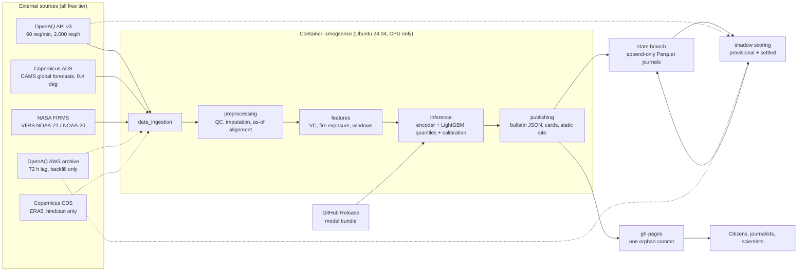

# System Architecture

> **Audience:** engineers implementing or operating SmogSense. **Status:** specification for Phases 0–4.
> Companion documents: [data engineering](data-engineering.md) · [ML architecture](ml-architecture.md) ·
> [evaluation](evaluation-strategy.md) · [deployment & ops](deployment-and-ops.md) · [dissemination & UI](dissemination-and-ui.md) ·
> [verification log](verification-log.md).

## 1. Architectural principles

| # | Principle | Consequence |
|---|---|---|
| P1 | **Batch, not service.** One forecast per day; nothing runs between runs. | No servers, no databases, no autoscaling. Compute is an ephemeral GitHub Actions runner. |
| P2 | **Idempotent by construction.** Re-running an issuance must be a safe no-op (or a safe overwrite with `SMOGSENSE_FORCE=1`). | Three schedule triggers can share one workflow; a dropped cron event costs nothing. |
| P3 | **Point-in-time correctness.** A feature at issuance *T* may use only data that was *knowable* at *T*. | Bitemporal tables (`ts_utc`, `ingested_at_utc`), an explicit as-of rule per source, and a daily input snapshot for honest replay. |
| P4 | **Container parity.** Laptop = CI = production. | One Dockerfile, one compose file, one CLI. Resource limits emulate the smallest runner (2 vCPU / 7 GB). |
| P5 | **Degrade, don't fail.** A degraded forecast labelled as such beats silence. | A four-level degradation ladder (§7) with explicit exit codes and public banners. |
| P6 | **Static delivery.** The public product is files. | Any static host works (GitHub Pages primary; Cloudflare Pages optional mirror). No runtime to attack or pay for. |
| P7 | **$0.00, permanently.** Only permanent free tiers; every limit is documented and budgeted. | See the budget in [deployment & ops](deployment-and-ops.md#1-zero-cost-resource-budget). |

## 2. Logical architecture



Dotted edges are *not* on the live critical path: ERA5 and the AWS archive serve historical backfill and settled
scoring only (ERA5 lags by about five days; the archive publishes 72 hours after the end of the local day).

### Separation of concerns

```
Data pipelines → Preprocessing / feature store → Training & adaptation → Inference → Static-site generation
 data_ingestion     preprocessing, features         models (offline)       inference     publishing, visualization
```

Each arrow is a **file contract** (a Pandera schema in `data/schemas/`), not a Python call. Any stage can be re-run, tested
or replaced independently, and every stage validates its output before writing it.

## 3. Daily execution cycle (00:00 UTC)

`T0 = 00:00 UTC = 05:00 PKT` is the **forecast reference time**. The workflow is *triggered* at 00:17 UTC: GitHub documents that
scheduled runs can be delayed under load, particularly at the start of every hour, so SmogSense never schedules on minute 0.
Two further triggers (02:47 and 05:47 UTC) run the same command; if the primary run already published this issuance they exit
with code 11 after about two minutes.

| Offset from trigger | Step | Budget | Notes |
|---|---|---|---|
| +0:00 | Checkout, attach `state` branch, host pre-check | 1 min | If the manifest for the issuance date says `published: true` and FORCE=0, skip the image pull and everything below |
| +0:01 | Pull image `ghcr.io/<owner>/smogsense:sha-<commit>` | 2 min | Falls back to a local build if the commit has no image yet |
| +0:03 | `ingest live`: OpenAQ ∥ CAMS ∥ FIRMS (concurrent) | ≤ 20 min | OpenAQ ≈ 60–150 requests at ≤ 48/min; CAMS = one ADS request (queue + download, wall-clock budget 20 min); FIRMS = 2–3 requests |
| +0:15 | `features build` (as-of aligned, point-in-time) | 2 min | Also writes the input snapshot to `state/inputs/` |
| +0:17 | `forecast run`: model bundle → 19 quantiles × 3 horizons × (stations + city) | 2 min | Validated against `forecast_log.schema.yaml`, monotone, bounded |
| +0:19 | `bulletin render`: public JSON, English + Urdu cards, Open Graph images | 2 min | Pillow + Raqm; no browser |
| +0:21 | `site build` and `site validate` | 1 min | Page-weight, schema, language-parity budgets |
| +0:22 | Host: commit `state`, force-push `gh-pages`, optional Cloudflare + Telegram | 2 min | Git token never enters the container |

Typical wall-clock: **15–25 minutes**; hard cap 40 (`timeout-minutes`). Monthly cost: three runs per day, two of them ~2-minute no-ops,
daily workflow ≈ 870 min/month, all scheduled workflows ≈ 1,070 (estimates), inside the 2,000-minute free allowance even for a private repository and unmetered for a public one.

## 4. Data availability and the as-of rule

A forecast issued at time *T* may use only what exists at *T*. Verified publication behaviour (October 2026):

| Source | Availability | Rule |
|---|---|---|
| **CAMS global forecast** (ADS) | 00 UTC run guaranteed by **10:00 UTC**; 12 UTC run by **22:00 UTC** | `B*(T) = max{ B ∈ {00Z, 12Z} : B + 10 h ≤ T }` |
| OpenAQ API | Provider-dependent, typically 1–3 h behind real time | Use rows with `ingested_at_utc ≤ T`; data cutoff `T_c` = latest complete hour |
| FIRMS NRT (VIIRS) | ≈ 3 h after overpass | Use detections with `acq_datetime + 3 h ≤ T` |
| ERA5 | ≈ 5 days (ERA5T) | **Never operational**; hindcast and diagnostics only |
| OpenAQ AWS archive | 72 h after local end of day | Backfill and settled scoring only |

For lookback hour t, use the latest cycle B with B ≤ t and B ≤ B*(T).
00Z: 12Z of day D−1 (δ 12h, level 1 24h)
06Z: 12Z of day D−1 (δ 18h, level 1 30h)
12Z: 00Z of day D (δ 12h, level 1 24h)
18Z: 00Z of day D (δ 18h, level 1 30h)

A single function, `preprocessing/alignment.asof_cams_run`,
implements it and is unit-tested at all four lattice points.

The **lookback** meteorology and aerosol channels are *stitched*: for each valid hour *t* in `[T − 72 h, T]` take the forecast
from the most recent cycle that was knowable at *t* and has lead < 12 h (an analysis-like series). Training and serving use the
same product and the same stitching, so there is **no reanalysis-to-forecast distribution shift** (a risk in the original plan, which
trained on ERA5 and served from a different NWP model whose boundary-layer height is defined differently).

## 5. Component responsibilities and CLI contract

| Package | Responsibility | Reads | Writes |
|---|---|---|---|
| `data_ingestion` | Talk to the outside world; land raw payloads with manifests. No scientific logic. | APIs | `data/raw/**` |
| `preprocessing` | QC, imputation, units, as-of alignment, grid → station extraction | raw | `data/interim/**` |
| `features` | Physics-informed features, targets, windows, sparse-network simulation | interim | `data/processed/feature_store/**` |
| `models` | Encoders, heads, LightGBM ensemble, meta-learning, calibration, baselines | feature store | model bundle |
| `inference` | Daily forecast, degradation ladder | features + bundle | `forecast_log` |
| `evaluation` | Scores, sparsity experiment, significance tests, shadow ledger | logs + obs | `score_log`, reports |
| `visualization` | Fan-chart geometry, diagnostics, Pillow+Raqm cards | forecasts | PNG/SVG |
| `publishing` | AQI mapping, bulletin JSON, i18n, static site, delivery checks | forecasts | `site/**` |

Every stage is a command of one Typer CLI (`smogsense`). The names below are fixed in Phase 0; Phases 1–4 implement them.

| Command | Purpose | Notable options |
|---|---|---|
| `doctor [--online]` | Validate environment, config parse, credential presence (never printing secrets); `--online` makes one cheap call per source | |
| `ingest live` | OpenAQ + CAMS + FIRMS for one issuance, concurrently | `--issuance` |
| `ingest openaq \| openaq-archive \| cams \| era5 \| firms \| maiac` | Single-source ingestion (backfill-capable) | `--domain --start --end --resume` |
| `features build \| backfill` | Build features for one issuance / for a season | `--domain --season` |
| `train source \| meta \| lgbm \| calibrate \| bundle` | Offline training stages | `--version` |
| `forecast run` | Produce `forecast_log` for one issuance | `--issuance` |
| `score shadow` | Verify closed windows | `--stage provisional\|settled` |
| `eval ladder \| sparsity \| report` | Experiments and figures | `--config` |
| `bulletin render` | Public JSON + cards for one issuance | `--issuance` |
| `site build [--stale] \| validate` | Static site and its budget checks | |
| `publish telegram` | Optional channel post (free Bot API) | |
| `state exists \| verify` | Idempotency guard (exits 11 when published); journal integrity and size budget | |
| `run daily \| backfill \| score` | Orchestrators (idempotent) | `--max-wall-minutes` |

**Exit codes** (stable API for workflows): `0` ok · `10` degraded but published · `11` already published (no-op) · `20` inputs unavailable ·
`30` contract violation (schema or budget) · `40` quota or rate-limit exhausted · `50` internal error. Under GitHub Actions `run daily`
emits `::group::` markers per stage and writes `data/processed/run_manifests/latest_summary.md`, which the workflow appends to the job summary.

**Run manifest** (`run_manifests/<run_id>.json`): `run_id`, `issued_at_utc`, `is_rerun`, `published`, `adaptation_status`, observed latency, git SHA, config hash, image digest, issuance, per-stage start/end/duration, per-source request counts
against budget, bytes downloaded, freshness (age of newest observation, CAMS base time, FIRMS latest acquisition), QC rejection rates by flag,
number of available stations *N*, degradation level, validation-gate results, exit code.

## 6. State, storage, and persistence

There is no database. Three free stores, each with one job:

| Store | Holds | Why this one |
|---|---|---|
| **Orphan `state` branch** (cloned to `.state/`) | Append-only Parquet/JSON journals: `obs/`, `inputs/`, `forecasts/`, `scores/`, `manifests/`, `site_json/` | Versioned, free, diffable, atomic per commit. New file per day ⇒ history = content; ~150 KB/day ≈ 55 MB/year, far below the 1 GB repository recommendation |
| **GitHub Releases** | Model bundles (`models-vX.Y.Z`) and backfilled datasets (`data-backfill`) | 2 GiB per asset, no total limit, outside repository size |
| **Actions cache / artifacts** | Raw GRIB/CSV during a run; diagnostics on failure (14 days) | Ephemeral by design |

**Why a daily *input snapshot*.** `state/inputs/` stores the exact aligned inputs each forecast consumed (stations × 72 h × channels, CAMS stitched
series, fire exposure). A model developed *after* the smog season has started can then be replayed on genuinely point-in-time inputs ("replay shadow",
reported separately from live shadow). Without the snapshot, a late model could only be backtested on reconstructed data, which is the leakage-prone
situation the shadow run exists to avoid. See [evaluation](evaluation-strategy.md#9-prospective-shadow-run-protocol).

**Write protocol.** Containers write only under bind-mounted `data/` and `.state/`; the *host* commits and pushes `state` (retry with rebase, four attempts) and
force-pushes `gh-pages` as a single orphan commit. Concurrency group `smogsense-state` serialises every job that writes `state`.

## 7. Failure handling and degradation ladder

Failures are **typed** (`errors.py`) and map to levels; the ladder reacts to types, never to message text.

| Level | `mode` | Trigger | Method | Exit | Public banner |
|---|---|---|---|---|---|
| 0 | `full` | All inputs present; promoted bundle valid | Learned hybrid model | 0 | none |
| 1 | `stale_cams` | The as-of CAMS run is absent after the wait budget but an earlier cycle (≤ 24 h older) exists | Learned model with the older cycle (larger lead offset) | 10 | "Reduced accuracy: earlier atmospheric model run used" |
| 2 | `baseline_only` | `promoted_bundle: none`, bundle fails sha256/compatibility, or inference raises | Probabilistic CAMS-BC baseline (M2) | 10 | "Simplified forecast" |
| 3 | `observations_only` | No usable CAMS within 24 h | Probabilistic persistence + climatology (M0/M3) | 10 | "Reduced accuracy: sensor readings only" |
| 4 | *(no publication)* | No observations **and** no CAMS, or the outgoing bulletin violates a hard gate | Keep the last bulletin; open an alert issue | 20 / 30 | Staleness banner appears client-side once the bulletin is > 36 h old; publishes a static expiry notice |

Missing **fire** data does not change the level: fire features are masked (the model is trained with input-group dropout, see
[ML architecture](ml-architecture.md#11-training-protocol-and-reproducibility)) and `provenance.sources[firms].status = "missing"` is published.
No recent **observations** keeps `full` in sensor-free mode (*N* = 0), with correspondingly wider intervals.

**Validation gates before publication.**
*Hard* (any failure ⇒ exit 30, nothing published): schema validity; quantiles monotone and in [0, 2000] µg/m³; category fields consistent with quantiles;
both languages present; page-weight and card-size budgets; adaptation outcome recorded. *Soft* (publish, annotate, open an issue): median more than 4× or less than 0.25× CAMS-BC
or persistence; CAMS or FIRMS older than expected; QC rejected more than 40 % of stations; fewer than 3 eligible stations; latent drift flagged.

**Source failure matrix.**

| Source | Failure | Handling |
|---|---|---|
| OpenAQ | 429 | Header-aware backoff; after 3 consecutive 429s the circuit opens for 15 min (repeated violations can lead to a ban) |
| OpenAQ | 5xx / timeout | Tenacity retries (≤ 6, exponential, full jitter, honours `Retry-After`); then proceed with partial stations |
| ADS | Licence not accepted (403) | Fatal, clear message ("accept the dataset licence on the website once"), exit 20 |
| ADS | Queue slow / run not yet published | Poll within the 20-min budget; level 1 if an earlier cycle exists; the 02:47 / 05:47 retries try again |
| FIRMS | 429 / 5xx | Retry; else mask fire group |
| Any | Schema violation | Exit 30; the previous bulletin stays live |
| GitHub | Cron event dropped | The two retry triggers (idempotent) |
| GitHub | Schedules disabled after 60 days of repository inactivity | `repo-keepalive.yml` plus the daily `state` push; owner is also e-mailed by GitHub |

## 8. Static site deployment pipeline

```
site build ─▶ site validate ─▶ (host) state commit+push ─▶ (host) gh-pages orphan force-push ─▶ GitHub Pages ─▶ users
                                                            └─▶ optional: wrangler pages deploy ─▶ Cloudflare Pages
```

* `site validate` enforces the budgets in `configs/bulletin.yaml` (HTML ≤ 60 KB, CSS ≤ 25 KB, JS ≤ 30 KB, page weight ≤ 500 KB excluding fonts, card PNG ≤ 400 KB,
  Open Graph ≤ 300 KB), language-tree parity, and `bulletin.schema.json`.
* `scripts/publish_ghpages.sh` refuses an incomplete site, refuses a site over 200 MB (GitHub Pages hard limit is 1 GB), adds `.nojekyll`, and force-pushes a
  **single-commit** `gh-pages` branch so history never grows. Verified locally against a bare repository: two deployments leave exactly one commit.
* GitHub Pages is **only available for public repositories on the Free plan**; the repository must therefore be public (it should be, for open research).
* Rollback: re-run `daily-forecast` via *workflow_dispatch* with an earlier `issuance` and `force`, or rebuild any day from `state/site_json/`.

## 9. Security and secrets

| Secret | Scope | Used by |
|---|---|---|
| `OPENAQ_API_KEY`, `ADS_API_KEY`, `CDS_API_KEY`, `FIRMS_MAP_KEY` | Repository secrets, read-only data access | App container (env pass-through) |
| `TELEGRAM_BOT_TOKEN`, `TELEGRAM_CHAT_ID`, `CLOUDFLARE_API_TOKEN`, `CLOUDFLARE_ACCOUNT_ID` | Optional | Optional steps only |
| `GITHUB_TOKEN` | Per-run, least privilege (`contents: write` only in publishing jobs) | **Host scripts only; never passed into a container** |

Defences, all enforced by `tests/unit/test_repo_hygiene.py`: third-party actions pinned to commit SHAs (Dependabot updates them); top-level `permissions: contents: read`;
no `pull_request_target`; every job has `timeout-minutes`; containers run non-root, read-only, with all capabilities dropped; log redaction masks configured secrets; the
site ships a strict CSP (no inline script/style, no external hosts). Integrity of the published bulletin matters more than confidentiality, so the validation gates are
part of the security model.

## 10. Observability and quality gates

* **Per-run:** the manifest and job summary above; failures open (or comment on) a single GitHub issue per title via `scripts/alert_issue.sh`.
* **Per-day freshness metrics** are published in the bulletin's `provenance.sources[*].as_of_utc`.
* **Per-season:** the public accuracy page renders rolling 30-day CRPS skill vs CAMS-BC, the reliability diagram and coverage, always with sample sizes.
* **Test pyramid.** Unit (pure functions; `hypothesis` property tests for rearrangement and CRPS identities) → contract (recorded API shapes, schemas; live checks opt-in with `network`)
  → integration (the entire pipeline on fixtures, < 120 s, offline) → e2e (site build and budgets). CI runs everything except `network`-marked tests on every pull request.
